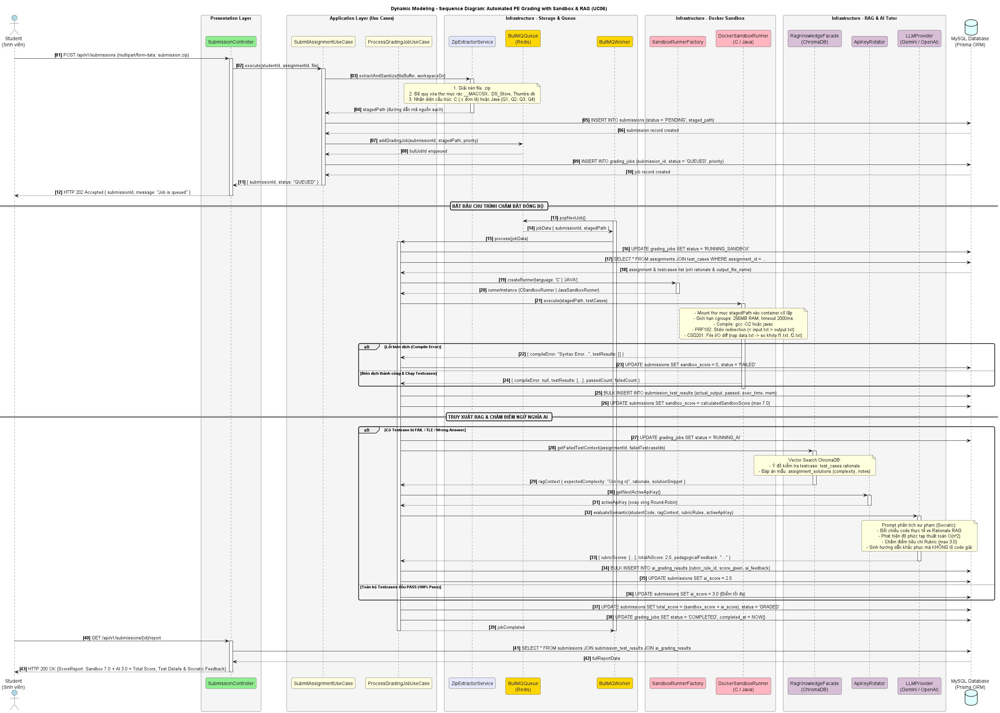

# TÀI LIỆU THUYẾT MINH MÔ HÌNH HÓA TĨNH VÀ ĐỘNG (STATIC & DYNAMIC MODELING)
**Học phần:** SWD392 – Software Architecture and Design (FPT University)  
**Dự án:** AITA (AI-powered Teaching Assistant System)  
**Nhóm sinh viên:** GROUP 2 (Lớp SE19C)  
**Mục tiêu:** Cung cấp tài liệu phân tích thiết kế đầy đủ cho đợt **Evaluation 2 (Architecture & System Modeling)**.

---

## 1. TỔNG QUAN VỀ MÔ HÌNH HÓA TRONG SWD392

Theo chuẩn kiến trúc phần mềm và giáo trình SWD392 (Chapter 7 & 8):
1. **Mô hình hóa Tĩnh (Static Modeling):** Mô tả **cấu trúc tĩnh** của hệ thống, bao gồm các lớp thực thể (Domain Entities), các thuộc tính, khóa chính (PK), khóa ngoại (FK) và các mối quan hệ cấu trúc (Association, Multiplicity) giữa chúng mà không phụ thuộc vào yếu tố thời gian.
2. **Mô hình hóa Động (Dynamic Modeling):** Mô tả **hành vi và sự tương tác theo thời gian** giữa các đối tượng để thực hiện các kịch bản nghiệp vụ (Use Cases). Bao gồm:
   - **Sequence Diagram (Sơ đồ tuần tự):** Trình bày thứ tự gửi và nhận thông điệp giữa các thành phần qua các tầng kiến trúc (Boundary $\to$ Controller $\to$ Service $\to$ Infrastructure $\to$ Database).
   - **State Machine Diagram (Sơ đồ máy trạng thái):** Trình bày vòng đời biến đổi trạng thái của các thực thể cốt lõi (`GradingJob`, `Submission`) khi có các sự kiện kích hoạt.

---

## 2. MÔ HÌNH HÓA USE CASE & TĨNH (USE CASE & STATIC MODELING)

### 2.1. Sơ đồ Use Case tổng thể (Use Case Diagram)
*File sơ đồ:* [Usecase Diagram.jpg](plantuml/Usecase%20Diagram.jpg)


Sơ đồ phân định ranh giới hệ thống **AITA System (PE Zipped Grading)** với 3 Actor người dùng và 3 Actor hệ thống bên ngoài:
- **Admin:** Quản trị người dùng & RBAC (`UC02`), Cấu hình xoay vòng AI Key (`UC03`), Giám sát hàng đợi Redis & Docker Sandbox (`UC04`).
- **Lecturer:** Đăng nhập (`UC01`), Tạo bài tập PE C/Java (`UC05`), Quản lý mẫu Prompt AI (`UC06`), Trích xuất phân tích Git commit (`UC12`).
- **Student:** Đăng nhập (`UC01`), Nộp bài PE `.zip` / Git (`UC07`), Tương tác hỏi đáp với 24/7 AI Tutor (`UC11`), Xem đóng góp Git cá nhân (`UC12`).
- **Quan hệ `<<include>>` cốt lõi:**
  - `UC07` (Nộp bài PE) $\xrightarrow{\ll include\gg}$ `UC08` (Giải nén & Validate file zip sạch).
  - `UC08` $\xrightarrow{\ll include\gg}$ `UC09` (Chạy testcase trong Docker Sandbox Service).
  - `UC07` / `UC09` $\xrightarrow{\ll include\gg}$ `UC10` (Chấm ngữ nghĩa AI kết nối LLM Provider API).

---

### 2.2. Mô hình hóa tĩnh (Domain Class Diagram - 14 thực thể)
*Mã nguồn PlantUML:* [class_diagram_static_model.puml](plantuml/class_diagram_static_model.puml) (Nhấn `Alt + D` trong VS Code để xem).

### 2.1. Phân chia 4 Package miền nghiệp vụ (Bố cục 4 Tầng từ trên xuống dưới)

```
┌────────────────────────────────────────────────────────────────────────┐
│               MÔ HÌNH HÓA TĨNH CHUẨN THI PE FPT (14 THỰC THỂ)          │
├────────────────────────────────┬───────────────────────────────────────┤
│ 1. IAM & Academic Management   │ User, Course, CourseEnrollment        │
│ 2. Exam Specs & RAG Knowledge  │ Assignment, TestCase, RubricRule,     │
│                                │ AssignmentSolution (RAG)              │
│ 3. Submission & Docker Engine  │ Submission, GradingJob,               │
│                                │ SubmissionTestResult                  │
│ 4. AI Evaluation & Socratic    │ AiApiKey, AiGradingResult,            │
│                                │ AiTutorConversation, AiTutorMessage   │
└────────────────────────────────┴───────────────────────────────────────┘
```

> **Ghi chú về tối ưu hóa thị giác (Visual Optimization):**
> Sơ đồ áp dụng `skinparam linetype ortho` (các đường liên kết vuông góc 90 độ, dẹp tan các đường cong chéo spaghetti) và luồng mũi tên định hướng từ Trên xuống Dưới (`-down->`, `-right->`), giúp bố cục rõ ràng, chuyên nghiệp và cực kỳ dễ theo dõi.

### 2.2. Bảng ánh xạ thực thể, Khóa chính & Khóa ngoại đầy đủ

| Thực thể (Class) | Khóa chính (PK) | Khóa ngoại (FK) | Bội số quan hệ (Multiplicity) & Vai trò |
| :--- | :--- | :--- | :--- |
| **User** | `id` | Không | 1 User tạo 0..* Course (Lecturer); 1 User tham gia 0..* Enrollment (Student); 1 User nộp 0..* Submission cá nhân. |
| **Course** | `id` | `lecturerId` $\to$ `User.id` | 1 Course có 0..* Enrollment; 1 Course chứa 1..* Assignment PE. |
| **CourseEnrollment** | `id` | `courseId`, `studentId` | Liên kết N-N giữa Student và Course. Khóa unique: `(courseId, studentId)`. |
| **Assignment** | `id` | `courseId` $\to$ `Course.id` | 1 Assignment chứa 1..* TestCase; 1..* RubricRule; 0..* AssignmentSolution; nhận 0..* Submission. |
| **TestCase** | `id` | `assignmentId` $\to$ `Assignment.id` | Có `questionNo` (Q1..Q4), `outputFileName` (File I/O cho CSD201), `rationale` (ý đồ cho RAG). |
| **RubricRule** | `id` | `assignmentId` $\to$ `Assignment.id` | Định nghĩa tiêu chí chấm ngữ nghĩa AI (`weightPercent`, `promptInstruction`). |
| **AssignmentSolution** | `id` | `assignmentId` $\to$ `Assignment.id` | **Kho tri thức RAG:** Lưu code mẫu, ghi chú giải thuật và độ phức tạp kỳ vọng $O(n \log n)$. |
| **Submission** | `id` | `assignmentId`, `studentId` | Lưu `stagedPath`, điểm `sandboxScore` (max 7.0), điểm `aiScore` (max 3.0), tổng điểm `totalScore`. |
| **GradingJob** | `id` | `submissionId` $\to$ `Submission.id` (1-1) | Điều phối hàng đợi Redis; có `priority` (1-Cao, 2-Chuẩn, 3-Thấp), `retryCount` (max 3). |
| **SubmissionTestResult**| `id` | `submissionId`, `testCaseId` | Kết quả chạy từng testcase trong Docker (`passed`, `actualOutput`, `execTimeMs`, `memKb`). |
| **AiApiKey** | `id` | Không | Kho API Key (Gemini, Claude, OpenAI) có cơ chế xoay vòng Round-Robin chống lỗi 429. |
| **AiGradingResult** | `id` | `submissionId`, `rubricRuleId`, `apiKeyUsedId` | Lưu điểm và phản hồi sư phạm Socratic cho từng tiêu chí rubric của bài nộp. |
| **AiTutorConversation**| `id` | `submissionId`, `studentId` | Phiên trò chuyện giữa sinh viên và AI Tutor dựa trên ngữ cảnh bài nộp đã chấm. |
| **AiTutorMessage** | `id` | `conversationId` $\to$ `AiTutorConversation.id` | Tin nhắn chi tiết giữa Sinh viên và AI (`sender: STUDENT / AI`). |

---

## 3. MÔ HÌNH HÓA ĐỘNG (DYNAMIC MODELING)

### 3.1. Sơ đồ tuần tự mức hệ thống (High-Level System Sequence Diagram)
*File sơ đồ:* [Sequence Diagram.jpg](plantuml/Sequence%20Diagram.jpg)


Sơ đồ trình bày chu trình chấm bất đồng bộ 15 bước giữa các bên liên quan:
1. Sinh viên nộp file `Assignment.zip` qua Web/Mobile Client.
2. Client gửi `POST /api/submissions (Upload File)`.
3. API Gateway / Backend lưu bản ghi trạng thái `Pending` vào Database.
4. Đẩy job chấm `submission_id` vào hàng đợi Redis Queue.
5. Phản hồi ngay `HTTP 202 (Đã tiếp nhận)` cho Client (dưới 150ms), loại bỏ hoàn toàn nguy cơ timeout.
6. BullMQ Worker lấy job (`Worker Pop Job`).
7. Giải nén và lọc sạch file rác OS staging (`Unzip & Validate Artifacts`).
8. Khởi chạy container cô lập với cgroups (`Run Container / Execute Testcases`).
9. Nhận kết quả thực thi kiểm thử (`Pass/Fail, ExecTime, Memory`).
10. Gửi `POST /chat/completions` (Mã nguồn + Prompt RAG + Test Result) đến LLM Provider API.
11. Nhận phản hồi sư phạm Socratic và đánh giá điểm rubric (`Return Semantic Feedback & Rating`).
12. Cập nhật trạng thái `Completed` và lưu toàn bộ kết quả vào Database.
13. Client thực hiện polling `GET /api/submissions/{id}`.
14. Hệ thống trả về điểm Testcase và nhận xét định hướng từ AI.
15. Client hiển thị giao diện báo cáo điểm chi tiết cho sinh viên.

---

### 3.2. Sơ đồ tuần tự chi tiết Clean Architecture (Detailed Inter-Service Sequence Diagram)
*Mã nguồn PlantUML:* [sequence_diagram_dynamic_model.puml](plantuml/sequence_diagram_dynamic_model.puml)



Sơ đồ tuần tự mô tả chi tiết 5 giai đoạn tương tác động xuyên suốt các tầng Clean Architecture:
1. **Giai đoạn 1 (Submission & Staging):**
   - Sinh viên gửi `POST /api/v1/submissions` kèm file `.zip`.
   - `ZipExtractorService` giải nén, **đệ quy xóa sạch các file rác Mac OS (`__MACOSX`, `.DS_Store`, `Thumbs.db`)**, phân loại cấu trúc mã nguồn (PRF192 vs PRO192/CSD201) và tạo thư mục mã nguồn sạch `stagedPath`.
   - Tạo bản ghi `Submission` (status: `PENDING`) và đẩy `GradingJob` vào Redis Queue với mức độ ưu tiên `priority`.
   - Trả về ngay `HTTP 202 Accepted` giúp Client không bị treo kết nối.
2. **Giai đoạn 2 (Redis Worker & Docker Sandbox Execution):**
   - `BullMQWorker` lấy job từ hàng đợi $\to$ Cập nhật trạng thái `RUNNING_SANDBOX`.
   - `SandboxRunnerFactory` khởi tạo Runner tương ứng (C gcc hoặc Java javac).
   - Docker Container khởi chạy cô lập với cgroups: giới hạn **256MB RAM**, **Timeout 2000ms**.
   - Chạy testcases: với PRF192 dùng Stdio redirection, với CSD201 nạp `data.txt` và thực hiện so khớp kết quả **File-to-File Diff (`f1.txt, f2.txt`)**.
   - Lưu kết quả vào `submission_test_results`, tính điểm Sandbox (tối đa 7.0).
3. **Giai đoạn 3 (RAG Vector Search & Socratic AI Grading):**
   - Nếu có testcase bị FAIL/TLE/Wrong Answer $\to$ Chuyển trạng thái `RUNNING_AI`.
   - `RagKnowledgeFacade` thực hiện Vector Search trên ChromaDB: lấy `rationale` của testcase bị lỗi và code mẫu `assignment_solutions`.
   - `ApiKeyRotator` cấp phát API Key hoạt động tiếp theo.
   - Gọi Gemini/OpenAI phân tích đối chiếu code sinh viên với RAG context $\to$ Phát hiện nghẽn thuật toán $O(n^2)$ và sinh phản hồi Socratic hướng dẫn định hướng mà không tiết lộ đáp án.
   - Lưu điểm Rubric vào `ai_grading_results` (tối đa 3.0).
4. **Giai đoạn 4 (Tổng hợp & Hoàn tất):**
   - Tính điểm tổng: $\text{Total Score} = \text{Sandbox Score (max 7.0)} + \text{AI Score (max 3.0)}$.
   - Cập nhật `submissions.status = 'GRADED'` và `grading_jobs.status = 'COMPLETED'`.
5. **Giai đoạn 5 (Client xem kết quả):**
   - Sinh viên gọi `GET /api/v1/submissions/{id}/report` $\to$ Nhận bảng điểm chi tiết từng testcase và nhận xét định hướng của AI Tutor.

---

### 3.3. Sơ đồ cộng tác / truyền thông (UML Communication Diagram)
*File sơ đồ:* [Communication Diagram.jpg](plantuml/Communication%20Diagram.jpg)


Trong khi Sequence Diagram nhấn mạnh yếu tố thời gian, Communication Diagram thể hiện cấu trúc liên kết và đường truyền thông điệp giữa các đối tượng cộng tác:
- **1:** `Student` $\to$ `Web Client`: Submit Zip File
- **2:** `Web Client` $\to$ `Submission Controller`: POST /submit
- **3:** `Submission Controller` $\to$ `Unzip Service`: Extract & Validate Zip
- **4:** `Unzip Service` $\to$ `Docker Engine`: Run Test Cases
- **5:** `Docker Engine` $\to$ `Submission Controller`: Return Test Results
- **6:** `Submission Controller` $\to$ `AI Service`: Analyze Code Semantic
- **7:** `AI Service` $\to$ `Submission Controller`: Return AI Feedback
- **8:** `Submission Controller` $\to$ `Web Client`: Display Final Report

---

### 3.4. Sơ đồ máy trạng thái (State Machine Diagram - Vòng đời chấm bài)
*Mã nguồn PlantUML:* [state_diagram_dynamic_model.puml](plantuml/state_diagram_dynamic_model.puml)

Biểu diễn chu trình chuyển đổi trạng thái của `GradingJob` và `Submission`:
* `SUBMITTED`: Tải lên và lọc sạch file rác staging.
* `QUEUED`: Nằm trong hàng đợi Redis BullMQ theo mức độ ưu tiên.
* `RUNNING_SANDBOX`: Khởi tạo Docker, biên dịch (`gcc` / `javac`), chạy testcase bắt timeout 2s và kiểm tra File I/O.
  * Nếu Compile Error $\to$ Điểm Sandbox = 0.0, kết thúc sớm.
  * Nếu 100% Testcases Pass $\to$ Điểm AI tự động đạt tối đa 3.0 (bỏ qua RAG để tối ưu chi phí).
* `RUNNING_AI`: Kích hoạt khi có testcase hỏng $\to$ Truy xuất RAG ChromaDB $\to$ Xoay vòng API Key $\to$ Đánh giá Rubric & sinh phản hồi Socratic.
* `COMPLETED`: Tổng hợp điểm cuối cùng và mở quyền xem Score Report cho sinh viên.
* `RETRY_CHECK`: Cơ chế tự phục hồi (Self-healing): Nếu gặp lỗi hệ thống (Docker crash, đứt mạng), hệ thống tự động retry tối đa 3 lần với thuật toán **Exponential Backoff** ($2^n$ giây).

---

## 4. BẢNG CHECKLIST BẢO VỆ ĐỒ ÁN (DEFENSE CHECKLIST DÀNH CHO NHÓM)

Khi giảng viên phản biện về mô hình hóa trong buổi Review:
1. **Câu hỏi:** *"Hệ thống có bao nhiêu thực thể và tại sao lại cần bảng `assignment_solutions`?"*
   - **Trả lời:** Hệ thống có 16 thực thể được chia thành 5 phân hệ rõ ràng. Bảng `assignment_solutions` là hạt nhân của cơ chế RAG, lưu trữ đáp án mẫu, phân tích độ phức tạp kỳ vọng ($O(n \log n)$) để khi sinh viên bị TLE ở testcase lớn, AI có thể đối chiếu chính xác nguyên nhân mà không cần phỏng đoán.
2. **Câu hỏi:** *"Sự khác biệt giữa Mô hình hóa tĩnh và Mô hình hóa động là gì?"*
   - **Trả lời:** Mô hình hóa tĩnh biểu diễn cấu trúc quan hệ dữ liệu (Class Diagram), còn Mô hình hóa động biểu diễn dòng chảy dữ liệu và sự tương tác giữa các tầng kiến trúc theo thời gian (Sequence Diagram) cũng như vòng đời xử lý của tác vụ chấm (State Machine Diagram).
3. **Câu hỏi:** *"Luồng động giải quyết vấn đề nghẽn hệ thống khi nhiều sinh viên nộp cùng lúc như thế nào?"*
   - **Trả lời:** Nhờ tách biệt pha tiếp nhận (HTTP 202 trả về ngay) và pha xử lý bất đồng bộ qua Redis Queue + BullMQ Worker, Docker Sandbox chạy tuần tự hoặc giới hạn số worker đồng thời, đảm bảo CPU và RAM server không bao giờ bị quá tải.
